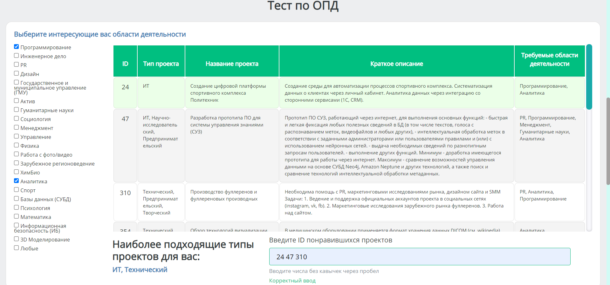

# Сайт, с помощью которого студенты могут подобрать для себя и проект и команду для Основ Проектной деятельности(ОПД)
### Вид сайта:
##### Анкета

##### Тест

##### Подбор кандидатов в команду

### Установка:
1. pip install -r requirements.txt из cmd
2. Раздобыть Токен VK и вписать его в  ```TOKEN =``` в app.py
3. Зарегистрироваться в heroku
4. Загружаете сайт в heroku, мануал снизу

5. Переходите по ссылке в терминале
